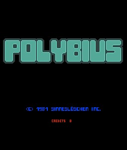

# A Mysterious Merchant
## Old Lore
At the HackGT night market, you see a single merchant with a...hexagon for a head? They sit quietly and have no wares, so you just take a picture of them. They rise to their feet and offer you no words, but you have a feeling they are hiding something.

## Better Lore
What a strange vendor! A hexagon for a head? But, where are their items? "Hey!", they shout at you. "Could you help me unpack? If you do, I can show you a secret that may be to your liking." You follow and they simply stand in front of their mat and ask you to take a picture. You comply, curious about the secret. They then get up and walk away, but you have a feeling they are hiding something.

## The Merchant


## Software Recommendations
While the software is explained in detail later, here is a short list of what may be useful when solving this puzzle
* Archive unzipping tool
    * MacOS/OS X, Linux: `unzip`
    * Windows: WinRAR, WSL/WSL2
* Cryptii.com

## So what are they hiding?
In order to figure out what they are hiding, we need to examine the image more closely. The image I attached here on this file is *not* the puzzle's image. In fact, this image is much *smaller* than the puzzle's, despite having the same pixel size and same image content.

What is different is *what exactly the image stores*.

Let's take a look at some internal statistics:

|File name|Dimensions|File Type|File Size|
|----|----|----|----|
|merchant-puzzle.png|2000x2000|PNG|1.08 MB|
|merchant-puzzle=copy.png|2000x2000|PNG|107 KB|

What? The puzzle PNG is 1.08 MB!? Yes, that's correct. The merchant was definitely hiding something. What that is can be seen in the text representation of the data. If we open notepad, we'll see these two things:

```
Ì%={¯‰®	ŽÒó.§/~¹«·bAìï‰Ö¾ZÈŸ®zH&¥ZCE´Ìö² …'œÏ›—§ÉÀ¨Ü`'ª¨XÅØmwxhTÃt”0Pý8YLÌOQêƒÇíöv™L!§NMRùâÒR˜øƒ6azD'H½×ýÖ&Ü÷X[:³ÿÝwÖÿòýÿöWÞÀÑÆé?+!;k[§ÿ8.ïhblaälçHÀÈôｈ­‘£‡½3ÇÿPÏŠÿ;Ä$„µx8YX™„Y8E™ØØYX9Ù…ؘ˜ÿñˆ³°ÿÿž`âdåabfú§C/akj÷Ÿ·ñ?ïù_ð³²Ò+ÚÙýçvæÿ¹«dáiBÀñ¿¢¡®hbJ¯¦ÅHÀLÀ¨ó_A1ß54 $å—#K&H¤fªKˆöóoü;ÁÀ›(fºHˆ† XS «øïX998:»;š˜B12²A‘’ŠÈ‰Bý_PK     иÞRS309
 Ï9
  $               puzzle-two-key.png
         ÍÃiz.n×¾i1n×Û(*z.n×PK     œ»ÞR$šPGa ,f  $           M9
 puzzle-two-parttoo.pdf
```

There in the data itself are another PNG and a PDF! But how do we get them out? Well, as it turns out, they are actually in a zip file that I merged with the PNG to form an image that doubles an archive. With the proper tools, we can extract this quite easily.

### Windows
You have two options: WSL2 or WinRAR. Both do the job very well, but have their pros and cons.

#### WSL2


WSL, or Windows Subsystem Linux, is a function added in Windows 10 releases that allows Windows users to add a Linux layer so that users can use the functionality of Linux machines without needing to overhaul the entire OS. It also opens up a whole host of programs that, previously, could not function on Windows because the OS was not a Unix distribution. For example, Docker used to be CLI only for Windows 10 distributions without the HyperV layer (WSL1). Now, users can download Docker with ease and have it run while still having all the functionality of Windows.

WSL acts like a virtual machine (VM) and uses RAM just as so. So you can, in fact, overload your machine like this. But, so as long as you don't need it, it will, at max, consume 500 MB of RAM. This is as much as one tab of Chrome.

Why did I go on this sort of tangent? We can use our Linux layer to carry out the unzipping operation. In Linux, there is a package called "unzip" that brings a script that can be run to unzip archives with multiple options. It should work on any Linux distribution, but you should double check that.

Since this is a VM, we still have mounts. Thus, to navigate to your Windows OS-level files, simply write:
```
cd mnt/{drive}/{file_path_to_image_directory}
```
From there, call the following:
```
unzip archive_name [options]
```
Now your files are available in the directory!

#### WinRAR


WinRAR could be possibly one of the most famous programs on Windows due solely because while it bugs you to pay for premium, you can *close* that window and use it for free. The creator himself doesn't even care and apparently did this on purpose.

I don't actually remember how or when I downloaded WinRAR when I made this puzzle since nowadays, I just use WSL2. There are mirrors available online and the official website is still [live](https://www.win-rar.com/start.html?&L=0) (and supports Windows 10!). Downloading this will override your system's default archiving and extracting process. However, it gives you access to a GUI that will let you choose to an archive and extract from it. This program recognizes PNG archive binaries and allows you to select them to extract from into your choice of directory.

### MacOS
MacOS is Unix so the command used by Linux applies:
```
unzip {archive_name} [options]
```

### Linux
As discussed in [WSL2](####WSL2), the command on Linux to unzip any archive is `unzip`. Thus, simply call:
```
unzip {archive_name} [options]
```

## The Crumpled Paper
This paper contains an odd font. Upon examination, you should notice you only need the text that is red, bolded, and underlined.


Every time something in the text was written, the information needed to solve it was available. For example, the text immediately below "A MystErious MercHant" says "A MystErious MercHant". The font is **NOT** a monospaced font like *Courier-New* so it will be difficult at first.

On a first pass, if you end up decoding as much as possible, you will get the sentence:
```css
T_e ans_er is _excoin
```
This is where inference comes into play. Notice that the first missing letter and the last have the same character. Logically speaking, to make a full sentence, the first word is "the". Thus, the missing character is an "h". The middle word turns out to be unimportant, but the word is "answer".

From this, we derive that our answer, the "key", is "hexcoin" (all lowercase, this is important)

This is only the start of the pain as what is next to come has stumped a majority of solvers...

### Information about the font
The font used was a custom font I made called "Codexicon" (it's a common name now for things, but back when I made it, it had zero search results). It's an absolutely disgusting font that I drew by hand. Given hints, it usually takes people 1-2 hours to decode entire sentences. Here's what the font's TTF generator sheet looked like:


Nasty right? It's all handwritten too. The plan originally was to make it for an ARG (Alternate Reality Game), but I scrapped that a few weeks in since I could not make it cryptic enough. Thus, it just sat in my hard drive for about a year and half before I dug it up for this puzzle. You can see, I could have been much nastier with the answer, but I gave you all a pass from what *could have been* the characters.

I could have even encoded it and it would have been an even larger mess to decode, especially with how characters like "v" or "z" look. Anyway, that's all I have, back to the puzzle!

## The (Dreaded) PDF
Oh the dreaded PDF! The roadblock for nearly every solver except 3. It was actually intentionally vague as was many hints because if I told you anything specific, you could have probably solved it right away. For the sake of it, here's a warning just in case it causes anxiety.

First, enter the password you got from the previous cipher:


This opens up the pdf to show this.


### What We Know
There's a very severe lack of context for anything on this PDF, but let's take a look at we do know right away:
- There is a 5x5 grid of 26 letters of which two share a cell
- The diagonal of the grid is colored in with a gradient and says "HEXGT"
- We have pairs of coordinates, but one pair seems to have no Y-coordinate
- There is a sentence
    - For Caesar
    - Shark for Gamma-B12
    - +1 888-447-5594
    - Cryptii

### The Hint
There was a, admittedly, horrible hint I sent out that explained what the 5x5 grid was since the latter sentence is effectively instructions on what to do with the output of the 5x5 grid.


This is a reference to the urban legend of *Polybius*, a mythical arcade cabinet supposedly made by the government meant to control the minds of players and make them into sleeper agents. The supposed start up screen looks like this:



So what does this mean? Well, the 5x5 grid is a variant of the Polybius square cipher. This also explains why the coordinates only use numbers from 1 to 5, inclusive.

### Polybius Square
This is the typical form of the Polybius square cipher.


For example, the value "11" maps to "A".

### Solving the Modified Polybius Square
Let's go back to [the pdf](##The(Dreaded)PDF). From what we know, we have a list of "coordinates". Now that we know that the square is a Polybius Square, we can apply the same concept to it. Below is a color-matched version of all of the "coordinates" to their associated cell.


As you can probably see by now, the diagonal color means nothing. In fact, two of the letters were not even used. I just designed the grid that way to look nice. Plus, since HackGT is now HexLabs, I felt it was right that I make some reference to that.

Matching each color/"coordinate" to their respective cells gives the string: `ignxbfjtnqyiufkzati`

### Using Cryptii
Cryptii is an online encoding and decoding tool meant for working with different kinds of ciphers and hashes. Upon entering the site for the first time, you are greeted with sample text feeding through a MK3 Enigma machine. Let's take a look at what we know from the sentence again.
* For Caesar
* Shark for Gamma-B12
* +1 888-447-5594

Let's break down each.
#### For Caesar
This is intentionally spelled this way, but what if you say it out loud? "For Caesar" sounds the same as "Four Caesar". Thus, on your modulation chain, add a "Caesar Cipher" block. Set the shift to four and set its mode to "Decode"

#### Shark for Gamma-B12
Shark is a type of Enigma Machine available on Cryptii. Swap the existing module to the Shark type. Set the mode to "Decode". Set the Reflector to "UKW B thin", Rotor 1 to "Gamma" and the Position of that rotor to 12.

#### Kratos?
Calling this number rings up the creator of God of War and Kratos. This is completely useless and is just a fun easter egg. The numbers themselves are what we need. Notice that after we set up Shark Gamma-B12, we have 10 remaining slots. Ignoring the country code (added solely for international participants to have some fun), add the numbers into the remaining 10 slots.

You should have the following as your module content.


For the text input, feed the string from the Polybius square in.

## The Answer
If everything was set up correctly, you should get "**secludednightmarket**" as your string output which is the correct answer!

## Red Herrings
- The mailbox braille was completely useless
- Nothing on the error page was relevant
- Get jebaited
- I just like colors
- Kratos
- [REDACTED]